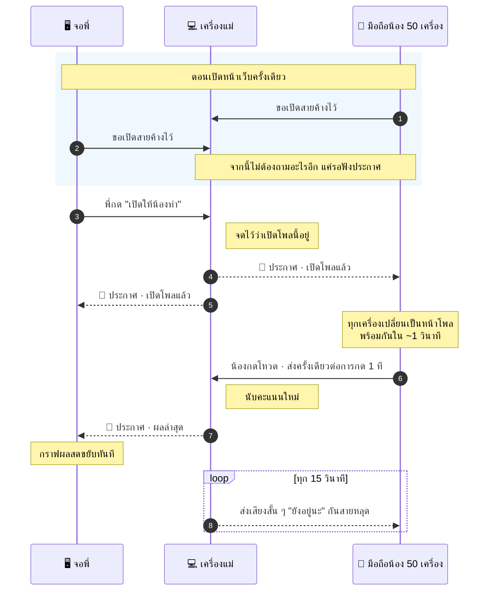
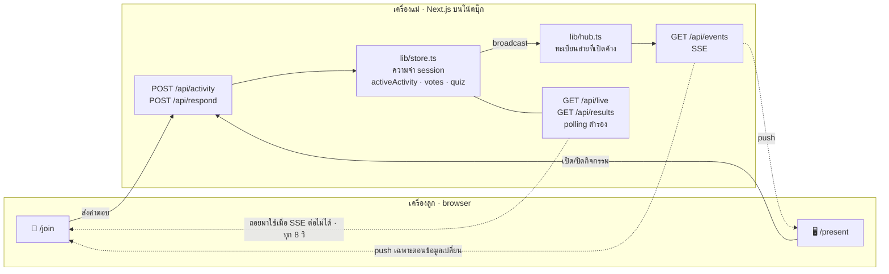

# Tech & AI Playground — BRAND'S Brain Camp 2026

เว็บแอปเดียวสำหรับเวิร์กช็อป **Tech skill · 60 นาที** (รอบขอนแก่น) — พี่คุมสไลด์บนโน้ตบุ๊ก
น้องสแกน QR เข้าจากมือถือเพื่อ **ทำกิจกรรม/ควิซ** โดยพี่เป็นคนกดเปิดกิจกรรมเองทีละอัน

- **จอพี่ `/present`** — เด็คสไลด์ (คุมด้วยปุ่ม/ลูกศร) + ปุ่มเปิดกิจกรรม + แผงผลสด + QR
- **มือถือน้อง `/join`** — 2 สถานะเท่านั้น: *กิจกรรมที่พี่เปิด* หรือ *standby "มองจอใหญ่"*
- ไม่มี DB · เก็บ state ใน memory · **ไม่เก็บข้อมูลส่วนตัวของน้อง** (anonymous id, PDPA)

> โมเดล "decouple": มือถือน้อง **ไม่ได้ mirror สไลด์พี่** — จะสว่างขึ้นเฉพาะตอนพี่กด **เปิดกิจกรรม**
> ให้น้องโฟกัสที่ interactive ไม่สับสนกับจอใหญ่

---

## เริ่มใช้งาน

```bash
npm install
npm run dev            # เปิด http://localhost:3000
```

- จอพี่: <http://localhost:3000/present>
- จอน้อง (ลองบนเครื่องเดียวกันก่อน): <http://localhost:3000/join>

Production:

```bash
npm run build && npm run start      # เพิ่ม -- -p 3100 เพื่อเปลี่ยนพอร์ต
```

### รันผ่าน VS Code (Task Runner)

มี `.vscode/tasks.json` ให้แล้ว — เปิด **Terminal → Run Task…** (หรือ `Cmd/Ctrl+Shift+B` = Run Dev Server) แล้วเลือก:

| Task | ทำอะไร |
|---|---|
| 1. Install Dependencies | `npm install` |
| 2. Run Dev Server (port 3000) ⭐ | รัน dev บนพอร์ต 3000 — เป็น default build task |
| 3. Build | build production |
| 4. Run Production Server (port 3000) | รันตัวที่ build แล้ว (แนะนำวันงานจริง) |
| 5. Build Static Fallback | build โหมดสำรองไว้ขึ้น Vercel |
| 6. Expose via Cloudflare Tunnel ⭐ | ทางหลักวันงาน — tunnel ไป `braincamp.ponggun.com` |
| 7. Expose via ngrok | สำรอง (ngrok free จำกัดจำนวน request) |
| 8. Show LAN URL | สำรองสุดท้าย — ให้น้องเข้าผ่าน Wi-Fi วงเดียวกัน |
| 9. Kill port 3000 | ฆ่าโปรเซสที่ค้างพอร์ต 3000 |
| 10. Stop Cloudflare Tunnel | ปิด tunnel ที่รันจาก Task 6 |

> ⚠️ Task 6/7 forward ไป `localhost:3000` → **ต้องรัน Task 2 หรือ 4 (พอร์ต 3000) ให้ขึ้นก่อน**
>
> 💡 build ใหม่แล้วหน้าเว็บขึ้น *"Application error"* / `ChunkLoadError` = server ตัวเก่ายังค้างอยู่
> → รัน **Task 9** แล้วค่อยรัน Task 4 ใหม่

---

## เอา QR ให้น้องสแกนหน้างาน (Cloudflare Tunnel)

แนวคิด: แอปรันบนโน้ตบุ๊กเหมือนเดิม แล้วให้ **cloudflared** (โปรแกรมตัวเล็ก ๆ) เปิดท่อจากเครื่องเราไปหา Cloudflare
น้องเข้าโดเมนของเรา → Cloudflare ส่งต่อเข้าท่อ → มาถึง `localhost:3000` — ไม่ต้องเปิดพอร์ต ไม่ต้อง fix IP และ **ไม่จำกัดจำนวน request**

```text
มือถือน้อง ──► https://braincamp.ponggun.com ──► Cloudflare ──[tunnel]──► cloudflared บนโน้ตบุ๊ก ──► localhost:3000
```

---

### ขั้นที่ 1 — เตรียมโดเมนให้อยู่ใต้ Cloudflare (ทำครั้งเดียว)

Cloudflare Tunnel ผูกกับ **zone** (โดเมนที่ Cloudflare ดูแล DNS ให้) เพราะงั้นต้องมีโดเมนอยู่ในบัญชีก่อน
เช็คที่ **[dash.cloudflare.com](https://dash.cloudflare.com)** → **Domains → Overview** ต้องเห็นโดเมนสถานะ **Active**

- **ยังไม่มีโดเมน** → **Domains → Registrations → Buy domain** (ซื้อผ่าน Cloudflare Registrar จบในที่เดียว ไม่ต้องรอ nameserver)
- **มีโดเมนอยู่กับเจ้าอื่น** → **Add a domain** → เลือกแพลน **Free** → Cloudflare จะให้ nameserver 2 ตัว
  เอาไปเปลี่ยนที่ผู้ให้บริการโดเมนเดิม → รอ propagate (ปกติไม่กี่นาที แต่กันไว้ถึง 24 ชม.) จนสถานะขึ้น **Active**

> ⏰ ข้อนี้เป็นข้อเดียวที่ **รอนาน** ถ้าต้องย้าย nameserver — ทำล่วงหน้าก่อนวันงานหลายวัน

---

### ขั้นที่ 2 — สร้าง tunnel บนเว็บ Cloudflare

1. เปิด **[Cloudflare Zero Trust](https://one.dash.cloudflare.com)** → เมนูซ้าย **Networks → Tunnels & Mesh** → ปุ่ม **Create a tunnel**
2. เลือกชนิด **Cloudflared** → ตั้งชื่อ tunnel (เช่น `braincamp`) → **Save tunnel**
3. จะเด้งหน้าต่าง **Install and run a connector** ขึ้นมา — หน้านี้มี **token** ของ tunnel เรา
   (ข้อความยาว ๆ ที่ขึ้นต้นด้วย `eyJhIjoi...` ท้ายคำสั่ง) → กดปุ่ม copy **แล้วเก็บไว้ก่อน** ยังไม่ต้องรันอะไร
   จะเอาไปใช้ในขั้นถัดไป · ถ้าปิดหน้าต่างไปแล้วเข้าดูใหม่ได้ที่ tunnel → **Configure → Install and run a connector**
4. ไปแท็บ **Published application routes** → **Add a published application route** ใส่ให้ครบ **2 แถว** ตามลำดับนี้

   | ลำดับ | Subdomain | Domain | Path | Service |
   |---|---|---|---|---|
   | 1 | `braincamp` | `ponggun.com` | `^/present` | Type **HTTP Status** → `404` ← กันจอ presenter หลุดออกเน็ต |
   | 2 | `braincamp` | `ponggun.com` | *(เว้นว่าง = ทุก path)* | Type **HTTP** → URL `localhost:3000` |

   > 🔤 ช่อง **Path เป็น regex** ไม่ใช่ wildcard — ใช้ `^/present` (เว้นว่าง = match ทุก path)
   > 📋 กติกาคือ **แถวบนสุดที่ตรงชนะ** — แถวบล็อก `/present` ต้องอยู่**เหนือ**แถวหลักเสมอ ไม่งั้นไม่มีผล
   > (แถวที่ 1 เป็นออปชัน ข้ามได้ถ้าอยากเปิด `/present` จากที่อื่นด้วย — แต่ต้องตั้ง `PRESENTER_KEY` แน่ ๆ)
5. Cloudflare สร้าง DNS record (CNAME) ให้อัตโนมัติ ไม่ต้องไปเพิ่มเอง

---

### ขั้นที่ 3 — ติดตั้ง cloudflared ที่เครื่อง แล้วเก็บ token

หน้า **Install and run a connector** จะโชว์คำสั่งแบบ `service install` (= ติดตั้งเป็นบริการ เปิดเครื่องแล้วรันเอง)
**สำหรับงานเวิร์กช็อปแนะนำแบบ manual** จะได้เปิด/ปิดเองได้ ไม่ค้างรันตลอดเวลา — โปรเจกต์นี้เลยเก็บ token ไว้ในไฟล์
`.cloudflared-token` (gitignore ไว้แล้ว) แล้วให้ VS Code **Task 6** อ่านไปใช้

#### 🍎 macOS

```bash
brew install cloudflared

# เก็บ token (แทนที่ eyJhIjoi... ด้วยของจริงจากขั้นที่ 2)
echo 'eyJhIjoi...' > .cloudflared-token

# ทดสอบรัน
cloudflared tunnel run --token "$(tr -d '[:space:]' < .cloudflared-token)"
```

#### 🪟 Windows (PowerShell)

```powershell
winget install --id Cloudflare.cloudflared
# หรือดาวน์โหลด .msi จาก https://github.com/cloudflare/cloudflared/releases/latest

# เก็บ token — ใช้ Out-File -NoNewline กัน BOM/บรรทัดว่างติดไปด้วย
'eyJhIjoi...' | Out-File -Encoding ascii -NoNewline .cloudflared-token

# ทดสอบรัน
cloudflared.exe tunnel run --token (Get-Content .cloudflared-token -Raw).Trim()
```

ขึ้นบรรทัด `Registered tunnel connection` = ต่อติดแล้ว · หน้า Tunnels บนเว็บจะเปลี่ยนสถานะเป็น **HEALTHY**
กด `Ctrl+C` เพื่อหยุด · หลังจากนี้ใช้ **Task 6** ใน VS Code แทนได้เลย (รองรับทั้ง Mac/Windows ในตัว)

> อยากให้ tunnel ขึ้นเองตอนเปิดเครื่อง ใช้คำสั่ง `service install` ที่เว็บให้มาแทน
> (Mac: `sudo cloudflared service install <token>` · Windows: `cloudflared.exe service install <token>` ใน Command Prompt แบบ Administrator)
> **ถ้าติดตั้งเป็น service แล้ว ไม่ต้องรัน Task 6 อีก** จะกลายเป็น connector ซ้อนกัน 2 ตัว

---

### ปิด / เปิด tunnel

| อยากทำ | ใช้ |
|---|---|
| เปิด tunnel | **Task 6** (หรือ `Ctrl+C` แล้วกดใหม่) |
| ปิด tunnel | **Task 10 · Stop Cloudflare Tunnel** |
| เช็คว่ารันอยู่ไหม | `pgrep -f "cloudflared tunnel"` · หรือดูโดเมน: **502** = tunnel ขึ้นแต่แอปยังไม่รัน · **error 1033** = tunnel ดับ |
| เลิกใช้ tunnel ถาวร | ลบ tunnel ในหน้า Zero Trust (DNS record หายตาม) |

> 💡 **ถ้าเผลอติดตั้งเป็น service ไว้** (`cloudflared service install`) การ kill โปรเซสเฉย ๆ จะไม่พอ เพราะระบบตั้ง `KeepAlive`
> ให้ปลุกตัวเองใหม่ — ต้อง `sudo cloudflared service uninstall` ก่อน แล้วค่อยกลับมาใช้ Task 6 / Task 10 ตามปกติ
> (tunnel, โดเมน, DNS บน Cloudflare ไม่หายไปไหน ตราบใดที่ `.cloudflared-token` ยังอยู่ กด Task 6 ก็ได้ URL เดิม)

**ปล่อย tunnel ค้างไว้ได้ไหม?** ได้ ไม่มีค่าใช้จ่าย ไม่กินทรัพยากร และเปิดทางเข้าแค่ `localhost:3000` เท่านั้น
แต่จำไว้ 2 ข้อ: (1) ถ้าวันหลังรันโปรเจกต์อื่นที่พอร์ต 3000 มัน**จะหลุดออกเน็ตทันทีโดยไม่รู้ตัว**
(2) ตอนแอปรันอยู่ ใครที่รู้ URL ก็ตอบกิจกรรมได้ — ข้อความจากกิจกรรมแบบพิมพ์ตอบจะขึ้นจอโปรเจกเตอร์สด ๆ
(`PRESENTER_KEY` กันได้แค่ปุ่มเปิด/ปิด/ล้างผล) · ถ้าไม่ได้ใช้ยาว ๆ ปิดด้วย Task 10 ไว้ก่อนสบายใจกว่า

---

### ขั้นที่ 4 — ผูก URL เข้ากับ QR

สร้าง `.env.local` (คัดลอกจาก `.env.example`) แล้วตั้ง

```bash
NEXT_PUBLIC_JOIN_URL=https://braincamp.ponggun.com
PRESENTER_KEY=ตั้งรหัสอะไรก็ได้ที่น้องเดาไม่ถูก
```

> ⚠️ `NEXT_PUBLIC_*` ถูกฝังตอน **build** → แก้ `.env.local` แล้ว **ต้อง Task 3 (Build) ใหม่** ไม่งั้น QR ยังชี้ localhost อยู่

---

### ขั้นที่ 5 — วันงาน

```text
Task 4 (Run Production Server) → Task 6 (Cloudflare Tunnel) → เปิด /present ที่ localhost:3000
```

พี่เปิดจอ presenter ที่ **localhost** ได้เลย ไม่ต้องผ่าน tunnel — QR ยังชี้ `https://braincamp.ponggun.com/join` ถูกเพราะอ่านจาก `NEXT_PUBLIC_JOIN_URL` (traffic ผ่าน tunnel จึงเหลือแต่ของน้องล้วน ๆ)

> ✅ Cloudflare Tunnel **ไม่จำกัดจำนวน request** และ URL คงที่ทุกครั้ง ทำ QR ล่วงหน้าได้
> ⚠️ ยังควรซ้อมจริง: เปิด tunnel แล้วให้เพื่อน 5–10 คนสแกนพร้อมกัน (ปิด Wi-Fi ใช้ 4G/5G เพื่อทดสอบเส้นทางจริง)

### อาการที่เจอบ่อยตอนตั้ง tunnel

| อาการ | สาเหตุ / วิธีแก้ |
|---|---|
| เปิดโดเมนแล้วขึ้น **502 Bad Gateway** | tunnel ต่อติดแล้วแต่ยังไม่มีอะไรฟังพอร์ต 3000 → รัน Task 4 ก่อน (ถ้าเพิ่ง restart server รอ 5 วิ แล้วรีเฟรช cloudflared ต่อกลับเอง) |
| ขึ้น **1033 / Tunnel error** | cloudflared ไม่ได้รันอยู่ หรือ token ผิด → เช็คหน้า Tunnels ว่าเป็น **HEALTHY** ไหม |
| tunnel **HEALTHY** แต่โดเมนขึ้น 404 | ยังไม่ได้ตั้ง Published application route (หรือใส่ Service เป็น `https://` ทั้งที่แอปเป็น `http`) |
| บล็อก `/present` ไม่ทำงาน (ยังเข้าได้) | ช่อง Path เป็น **regex** → ต้องเป็น `^/present` ไม่ใช่ `present*` · และแถวบล็อกต้องอยู่**เหนือ**แถวหลัก |
| QR ยังชี้ `localhost` | `NEXT_PUBLIC_JOIN_URL` ถูกฝังตอน build → แก้ `.env.local` แล้ว build ใหม่ |
| น้องเข้าได้แต่ผลไม่อัปเดต | เช็คว่าไม่มี proxy/แอนตี้ไวรัสบล็อก `/api/events` — แอปจะถอยไป polling เองใน 8 วิ ยังใช้งานได้ |

### ถ้าหน้างานมีปัญหา (ไล่จากบนลงล่าง)

| อาการ | ทำอะไร |
|---|---|
| Cloudflare ล่ม/ต่อไม่ติด | คอมเมนต์ `NEXT_PUBLIC_JOIN_URL` ใน `.env.local` → build ใหม่ → รัน **Task 7 (ngrok)** → เปิด `/present` ผ่าน URL ngrok |
| เน็ตงานล่มทั้งวง | **Task 8 (Show LAN URL)** → ให้น้องต่อ Wi-Fi เดียวกับโน้ตบุ๊ก |
| โน้ตบุ๊ก/แอปมีปัญหาทั้งหมด | QR สำรอง → build static (Task 5) ที่ deploy ไว้ล่วงหน้าบน Vercel |

---

## การคุมงานหน้างาน (จอพี่)

- **← / →** (หรือปุ่มบนแถบล่าง) เลื่อนสไลด์ · Space = ถัดไป
- สไลด์ที่มีกิจกรรมจะมีปุ่ม **▶ เปิดให้น้องทำ** → มือถือน้องสว่างพร้อมกัน · **⏸ ปิด · ดูผล** = กลับ standby
- แถบล่างโชว์ **จำนวนคนออนไลน์** และปุ่มเตือน **🟢 ยังเปิด: …** เผื่อเผลอเลื่อนสไลด์ทั้งที่ยังเปิดกิจกรรมค้างไว้
- **ล้างผลกิจกรรมนี้** = รีเซ็ตคะแนนของกิจกรรมนั้น (เช่น ซ้อมแล้วอยากเคลียร์)

ลำดับกิจกรรม: `icebreaker` (โพลละลาย) → `quickpoll` (คั่น) → `cluster-guess` (เดากลุ่ม) → `career-quiz` (จับกลุ่ม 6 ข้อ)

---

## ตัวแปรสภาพแวดล้อม (`.env.local`)

คัดลอกจาก `.env.example`:

| ตัวแปร | ความหมาย |
|---|---|
| `NEXT_PUBLIC_JOIN_URL` | URL สาธารณะที่น้องสแกน = `https://braincamp.ponggun.com` (จะกรอกสดในหน้า `/present` แทนก็ได้) |
| `NEXT_PUBLIC_STATIC_MODE` | `1` = โหมดสำรอง client-only (ดูด้านล่าง) |
| `PRESENTER_KEY` | รหัสที่ต้องกรอกในช่อง "รหัส presenter" หน้า `/present` ก่อนจึงจะคุมกิจกรรมได้ — **ต้องตั้งเมื่อเปิดผ่าน tunnel** ไม่งั้นใครก็สั่งเปิด/ล้างผลได้ |

---

## แผนสำรอง (Static fallback)

ถ้า tunnel/โน้ตบุ๊กมีปัญหา ยังให้น้องทำ **ควิซ + roadmap** เองได้ (ไม่มี live dashboard):

```bash
NEXT_PUBLIC_STATIC_MODE=1 npm run build
```

deploy ขึ้น **Vercel** (แนะนำ) แล้วทำ **QR สำรอง** ชี้ไปที่ `<vercel-url>/join`
ในโหมดนี้หน้า `/join` จะเป็นเมนูให้น้องกดทำกิจกรรมเองทั้งหมด โดยไม่ต้องต่อกับเครื่องพี่

> เตรียม QR 2 อัน (tunnel + static) ไว้ในสไลด์เดียว เผื่อสลับหน้างาน

---

## แก้เนื้อหา

| อยากแก้ | ไฟล์ |
|---|---|
| คำถามโพล / icebreaker | `lib/activities.ts` |
| ควิซจับกลุ่ม 6 ข้อ + น้ำหนักคะแนน | `lib/quiz.ts` |
| 5 กลุ่มสายเทค + roadmap + ลิงก์ + Advanced | `lib/clusters.ts` |
| ลำดับสไลด์ | `lib/deck.ts` |
| เนื้อหาบนสไลด์ (JSX) | `components/present/SlideView.tsx` |

> TODO: ใส่ลิงก์ทอล์ก/ช่องของพี่ป้องในสไลด์ `next-step` (`components/present/SlideView.tsx`, ตัวแปรใกล้ ๆ `RESOURCE_URL`)

---

## เปิดโพลแล้วเกิดอะไรขึ้น (ฉบับเข้าใจง่าย)

### คำศัพท์ 3 คำที่ต้องรู้ก่อน

- **เครื่องลูก (client)** = มือถือของน้อง กับ จอสไลด์ของพี่ — ตัวที่แสดงผลให้คนดู
- **เครื่องแม่ (server)** = โปรแกรมที่รันอยู่บนโน้ตบุ๊กพี่ — ตัวที่จำว่า "ตอนนี้เปิดกิจกรรมไหน ใครโหวตอะไรไปแล้วบ้าง"
- **คำขอ (request)** = การที่เครื่องลูกส่งข้อความไปถามเครื่องแม่ 1 ครั้ง แล้วได้คำตอบกลับมา 1 ครั้ง

### หลักการ: เปิดสายค้างไว้ แล้วรอฟังประกาศ

มือถือน้องไม่มีทางเดาเองได้ว่าพี่จะกดเปิดโพลตอนไหน แอปนี้เลยให้มือถือน้อง
**"เปิดสายค้างไว้" กับเครื่องแม่เครื่องละ 1 สาย** แล้วไม่ต้องถามอะไรอีกเลย
เหมือนวิทยุสื่อสารที่เปิดเครื่องคาไว้เฉย ๆ — เงียบจนกว่าจะมีคนประกาศ

ลำดับตอนพี่กดเปิดโพลจริง ๆ:



**ประหยัดยังไง:** ทั้งงานใช้แค่ **1 สายต่อ 1 เครื่อง** แล้วส่งข้อมูลเฉพาะ "ตอนมีอะไรเปลี่ยนจริง"
ซึ่งทั้งเวิร์กช็อปมีไม่กี่สิบครั้ง — น้อง 50 คนทั้งชั่วโมงจึงกินแค่ 50 สาย ไม่ใช่คำขอเป็นหมื่น
และเพราะเครื่องแม่ประกาศเองทันทีที่พี่กด จอน้องเลยเปลี่ยนภายในราว 1 วินาที

### รายละเอียดที่เผื่อไว้ 3 อย่าง

1. **ส่งเสียง "ยังอยู่นะ" ทุก 15 วินาที** — สายที่เงียบนานเกินไปจะโดนตัวกลางตัดทิ้ง เลยให้เครื่องแม่ส่งสัญญาณสั้น ๆ กันสายหลุด และใช้เป็นตัวนับว่ามีน้องออนไลน์กี่คนไปในตัว
2. **นับจำนวนคนจาก "สายที่ยังค้างอยู่"** — เลข 👥 บนแถบล่างคือจำนวนสายที่เปิดค้างอยู่จริง ๆ พอน้องปิดหน้าเว็บ สายหลุด ตัวเลขก็ลดเอง
3. **มีแผนสำรองอัตโนมัติ** — ถ้าเน็ตของน้องบางเครื่องเปิดสายค้างไม่ได้ เพราะบางเครือข่ายบล็อกไว้ มือถือเครื่องนั้นจะเปลี่ยนไปใช้วิธี **ถามเครื่องแม่เองทุก 8 วินาที** แทน — ช้าลงนิดเดียว ใช้งานได้ปกติ และน้องไม่รู้ตัวด้วยซ้ำ

---

## สถาปัตยกรรมย่อ (ฉบับศัพท์เทคนิค)

เทคนิคที่ใช้เปิดสายค้างชื่อ **SSE (Server-Sent Events)** — ช่องทางมาตรฐานของเว็บที่ให้ฝั่งเซิร์ฟเวอร์ส่งข้อมูลมาหาเบราว์เซอร์ได้เอง โดยไม่ต้องรอให้ถาม



| ไฟล์ | หน้าที่ |
|---|---|
| `app/api/events/route.ts` | ปลายทางของ "สายที่เปิดค้าง" — ส่งข้อมูลเฉพาะตอนเปลี่ยน + heartbeat |
| `lib/hub.ts` | ทะเบียนสายที่เปิดค้างอยู่ทั้งหมด + ฟังก์ชันประกาศออกทุกสาย |
| `lib/store.ts` | ความจำของ session (กิจกรรมที่เปิด, คะแนนโหวต, ผลควิซ) |
| `lib/useEventStream.ts` | ฝั่งเบราว์เซอร์ — ต่อสาย, ต่อใหม่เมื่อหลุด, ถอยไป polling ถ้าใช้ไม่ได้ |
| `lib/snapshot.ts` | ปั้นก้อนข้อมูลที่ส่งออก ให้ทั้ง SSE และ polling ใช้โครงเดียวกัน |

Stack: **Next.js 14 (App Router) · TypeScript · Tailwind CSS · qrcode** · ฟอนต์ไทย Sarabun/Prompt (self-host)
